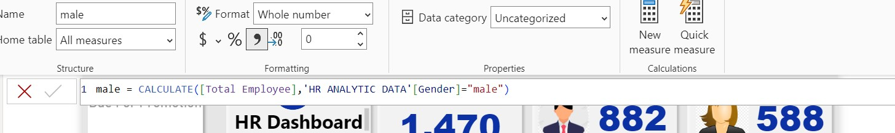
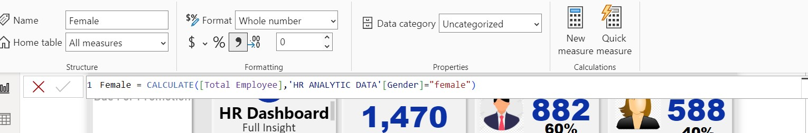
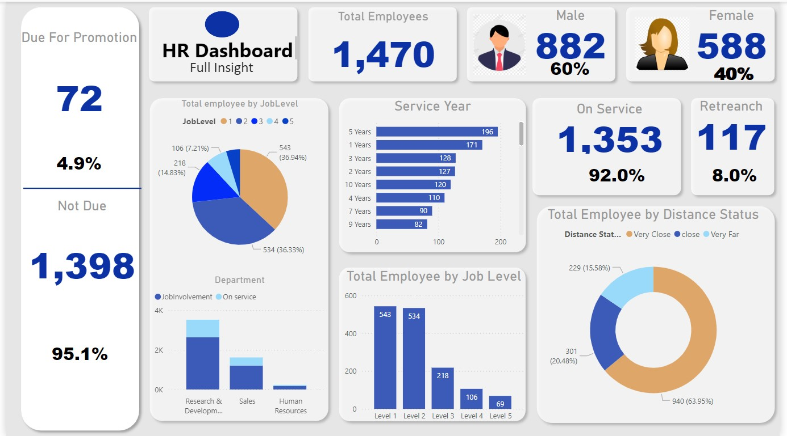
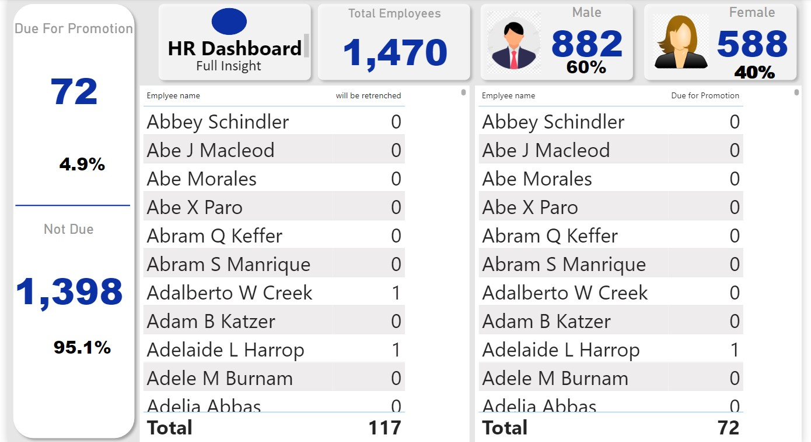
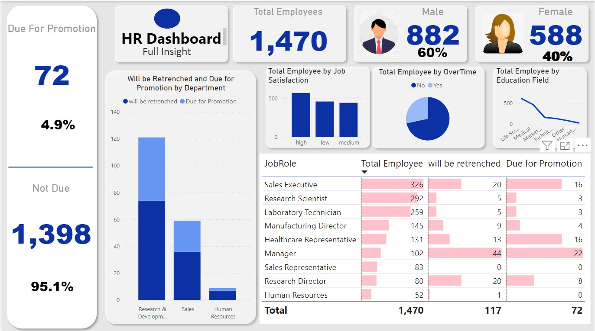

# HR-Analytics

## HR-Analytics Using Power BI

## Introduction
The Human Resources (HR) department is central to managing a company’s workforce and ensuring employee satisfaction, performance, and growth. This project utilizes Power BI to analyze employee data, uncover critical insights, and provide recommendations to aid HR decision-making. By examining metrics such as promotions, dismissals, job satisfaction, and performance, this analysis supports strategic workforce planning and operational efficiency.

**_Disclamer_** : _All datasets and reports do not represent any company but just a dummy dataset to demonstrate capabilities of Power BI._

## Skills Demonstrated
- Data Cleaning and Preparation
- Data Modeling
- DAX
- Filters
- Button
- Page Navigation
- Data Visualization using Power BI
- Use of Conditional Columns, Measures, and KPIs
- Interactive Dashboard Creation
- Storytelling with Data
- Critical Thinking

 ## Data Sourcing
The data was sourced from Kaggle and included two datasets:
- HR Analytics Data: Contains 1470 rows and 35 columns.
- HR Employee Data: Contains 1470 rows and 2 columns.

## Problem Statement
This analysis sought to address the following key questions:
1. How many employees are eligible for promotion based on years of service?
2. What is the distribution of employees across job levels?
3. How would dismissals affect the number of active employees?
4. What are the distances of employees from the office?
5. Which departments will experience significant changes due to promotions or dismissals?
6. What are employees' job satisfaction levels?
7. What proportion of employees work overtime?
8. How are high and low performance ratings distributed?
9. Which employees are eligible for promotions or dismissals?

## Data Cleaning
After loading the datasets into Power BI, I performed the following data preparation tasks:
1. Using the data preview feature on Power Query, I was able to identify that there were no null values and errors for each column in the HR Analytics Data’ table.
 
  
  
2. Created conditional columns to identify:
- Employees with 10+ years since their last promotion (eligible for promotion).
- Employees with 18+ years of service (marked for dismissal).
- Employees grouped by distance from the office.
- Then I calculated the total number of men and women and their percentages.
- The company needs to retreanch some employees for some reasons, let’s determine who those employees should be. We lay-off people that had spent above 18 years in the organization and the rest people stay.

  ### Here's a show of calculated colunms i created

#### Male
  
  #### Female
  
  #### % of Male
  
  #### % of Female
  
  #### Due for Promotion
  
  #### Not Due for Promotion
  
  #### Total Employee
  

  
3. I ensured data consistency and accuracy for effective visualization and storytelling.

## Data Modelling
To enable efficient analysis, I established relationships between the datasets using the EmployeeNumber as the primary key. This allowed seamless filtering and insight generation.

## Data Visualization
- After preparing the data, I created an interactive Power BI dashboard to display key insights.
- General Overview: A summary of total employees, gender distribution, and overall metrics.
- Employee Promotions and Dismissals: Visuals showing eligible employees by department and years of service.
- Job Levels and Satisfaction: Breakdown of job satisfaction and performance ratings across roles.
- Departmental Impact: Changes in workforce distribution due to dismissals and promotions.

  ### Hr Dashboard
  

  ### Employee Status
  

  ### overview
  

## Insights
1. Out of 1,470 employees, 72 have not received a promotion in over 10 years and are eligible for advancement.
2. Most employees have a minimum of 5 years of service, with 44 individuals recently joining the company.
3. A total of 117 employees, who have worked for 18 years or more, are set to be laid off. The majority of employees fall within job levels 1 and 2.
4. In the research and development department, 47 employees are slated for promotion, while 74 will be laid off, marking the largest impact within a single department.
5. Job satisfaction levels are fairly consistent across the workforce, though 459 employees report low satisfaction despite the majority expressing high satisfaction.
6. Around 30% of employees work overtime.
7. Performance ratings show that 84.6% of employees are rated highly, while 15.4% have lower ratings.
8. The sales manager role has the largest employee count, as well as the highest number of promotions and layoffs among all roles.

## Recommendations
1. Promotion Policy: Reduce the promotion cycle to less than 10 years to boost employee motivation.
2. Performance-Based Layoffs: Consider using performance metrics rather than tenure alone for dismissal decisions.
3. Upskilling Programs: Offer training opportunities for employees at levels 1 and 2 to advance their careers.
4. Job Satisfaction Initiatives: Conduct surveys and interviews to identify causes of dissatisfaction and address them through targeted interventions.
5. Remote Work Options: Provide flexible arrangements for employees living far from the office to improve productivity and retention.

## Conclusion
This analysis highlights actionable insights for HR decision-making, from identifying promotion opportunities to managing workforce distribution and addressing job satisfaction. These findings can guide strategic planning, improve employee engagement, and optimize operational efficiency.

Thank you for following through!
